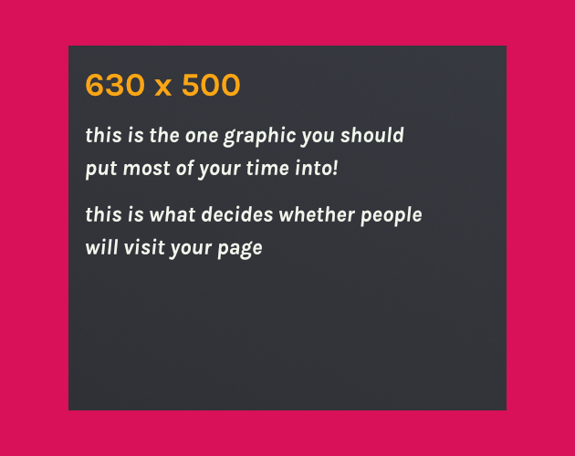

 # [GAME_NAME](GAME_LINK)
Made in X hours for [JAM_NAME](JAM_LINK)  
Theme: THEME  

Short desc  

 

Long desc  

# Downloads and Links
Available in [Windows, OSX, Linux, Android and Web](GAME_LINK).  
Consider downloading a game instead of playing the web version for better performance and stability.  
If you encounter any problem, please leave a issue!  

#### Mac Version Notes:
If you get "this package is from an unidentified developer" right click (or control-click) and select open. You should now get the option to open anyways.

#### Linux Version Notes:
Make sure to set the x86_64 as executable before running.

#  How to play
 * Controls
 * Do this to win
 * Do that to lose
 
#  Tips
 * Tips

# What is TriJam?
TriJam is a jam where your goal is to try and make something playable (and fun) in only 3 hours! How is that even possible, you ask? Well, just look at the history of previous TriJams and we're sure you'll be convinced that it is not only possible, but very manageable!  
Video about TriJam from Rocknight Studios: https://www.youtube.com/watch?v=6PysBXflWdg&ab_channel=RocknightStudios

# Credits
 * [Team-on](https://github.com/Team-on) - programmer
 * [Who](LINK) - role

# Used tools:
 * Unity 2020.2.0f1
 * Visual Studio 2019
 * Adobe Photoshop 2020
 * sfxr

# Used assets:
 * Unity game template - https://github.com/Team-on/UnityGameTemplate
 * Assets from template - https://github.com/Team-on/UnityGameTemplate/wiki/Used-assets
 * https://assetstore.unity.com/packages/2d/textures-materials/blood-splatter-decal-package-7518 - blood decals
 * https://assetstore.unity.com/packages/3d/props/furniture/medieval-tavern-pack-112546 - gameplay scene props
 * https://assetstore.unity.com/packages/3d/props/old-coin-49530 - coin
 * https://www.free-stock-music.com/peritune-harvest5.html - music
 * https://freesound.org/people/Sojan/sounds/334299/ - coin spin start
 * https://www.zapsplat.com/music/cartoon-impact-hit-with-twang-3/ - coin push start
 * https://freesound.org/people/HoseNoseSounds/sounds/510731/ - coin fall
 * https://www.zapsplat.com/music/body-hit-impact-with-baseball-bat-or-other-similar-club-hard-whack-with-a-crack-and-crunch-sound/ - coin hit first time
 * https://www.zapsplat.com/music/body-hit-impact-with-baseball-bat-or-other-similar-club-hard-whack-with-a-crack-and-squelch-of-blood-version-1/ - coin hit second+ time
 * https://freesound.org/people/cabled_mess/sounds/350869/ - pickup star
 * https://freesound.org/people/Eponn/sounds/420996/ - coin reflect

# Screenshots
  
  
  
